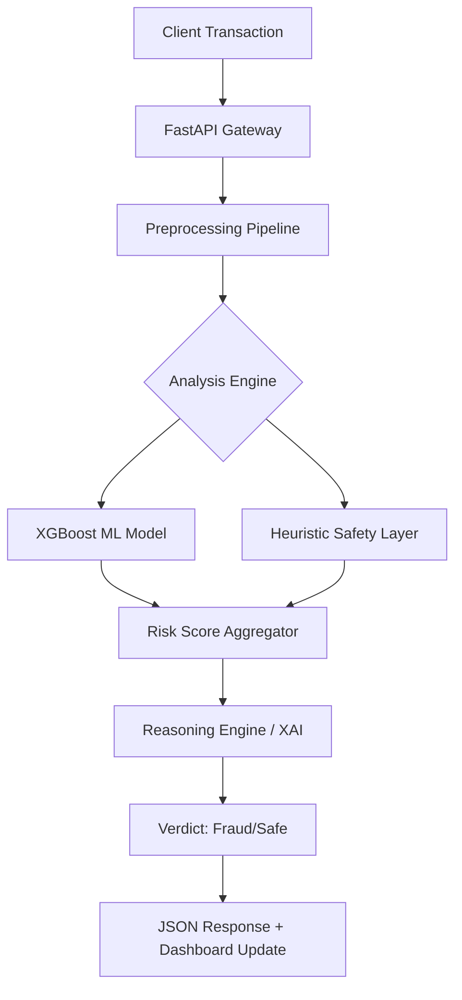

# 🛡️ FraudShield Pro: AI-Powered Transaction Intelligence

[](https://fastapi.tiangolo.com/)
[](https://xgboost.ai/)
[](https://www.docker.com/)
[](https://www.python.org/)
[](LICENSE)

**Advanced Real-Time Fraud Detection Engine for the High-Volume Digital Economy.**

FraudShield Pro is a production-ready, real-time fraud detection engine designed to protect financial transactions with ultra-low latency and industry-leading precision. Developed for high-stakes financial environments, it combines state-of-the-art Gradient Boosting with a heuristic "Safety Layer" and Explainable AI (XAI) capabilities.

---

## 🚀 System Highlights

- **Precision-First Engine**: Optimized XGBoost architecture achieving **91% Precision** and an **0.86 F1-Score**.
- **Ultra-Low Latency**: Sub-50ms inference time, making it ideal for real-time checkout flows.
- **Explainable AI (XAI)**: Native "Reasoning Engine" provides human-readable justifications for every flagged transaction.
- **Heuristic Safety Layer**: Fail-safe mechanisms for Out-of-Distribution (OOD) data and known high-risk patterns.

## 🧠 Intelligence Layers

1.  **Impossible Travel Velocity**: Detects geographic anomalies by calculating time-distance gaps between subsequent transactions.
2.  **Spending Pattern Aggregates**: Compares transaction amounts against historical user behavior using real-time statistical analysis.
3.  **Domain Risk Analysis**: Analyzes email provider reputations and identifies domain-spoofing attempts.
4.  **Neural Pattern Match**: Identifies complex fraud signatures that bypass traditional rule-based systems.

---

## 🏗️ Architecture



---

## 🛠️ Technical Stack

- **Backend**: [FastAPI](https://fastapi.tiangolo.com/) (Python 3.10+)
- **ML Framework**: [XGBoost](https://xgboost.ai/), [Scikit-Learn](https://scikit-learn.org/)
- **Data Handling**: Pandas, NumPy, Joblib
- **Frontend**: Pro Dashboard (Vanilla JS, CSS3, HTML5)
- **Deployment**: [Docker](https://www.docker.com/)

---

## 🏁 Quick Start

### 1. Local Setup
```bash
# Clone the repository
git clone https://github.com/utkarsh-aix/transaction-fraud-detection.git
cd transaction-fraud-detection

# Install dependencies
pip install -r requirements.txt

# Start the server
python api.py
```

### 2. Docker Execution
```bash
# Build the image
docker build -t fraudshield-pro .

# Run the container
docker run -p 8000:8000 fraudshield-pro
```

### 3. Access
- **Dashboard**: `http://localhost:8000`
- **Interactive API Docs (Swagger)**: `http://localhost:8000/docs`

---

## 📡 API Reference

### Predict Transaction Risk
`POST /predict`

**Payload:**
```json
{
  "TransactionID": 10001,
  "TransactionAmt": 150.50,
  "ProductCD": "W",
  "card1": 15000,
  "card4": "visa",
  "P_emaildomain": "gmail.com",
  "CurrentCountry": "USA",
  "LastCountry": "USA",
  "HoursSinceLastTransaction": 2.5
}
```

**Response:**
```json
{
  "result": "Not Fraud",
  "confidence_score": "12.45%",
  "risk_level": "Low",
  "reason": "Legitimate Profile"
}
```

---

## 📂 Project Structure

```text
├── api.py                   # FastAPI Application & Endpoints
├── preprocessing_pipeline.py # Feature Engineering & Data Preprocessing
├── output_v2/               # Serialized ML Models & Metadata
├── static/                  # Dashboard Assets (HTML/JS/CSS)
├── requirements.txt         # Project Dependencies
└── Dockerfile               # Containerization Config
```

---

**Confidential Property | Developed for Funding Round 2026**
