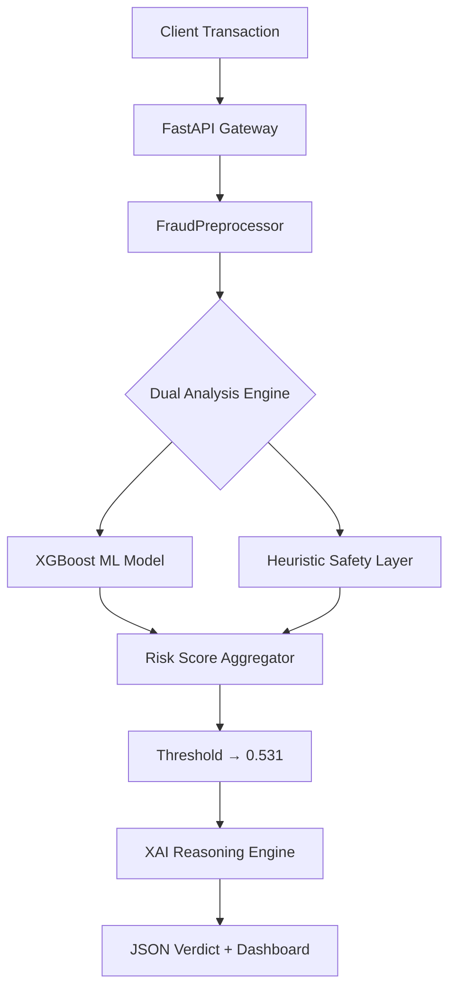

# 🛡️ FraudShield Pro: AI-Powered Transaction Fraud Detection

[](https://fastapi.tiangolo.com/)
[](https://xgboost.ai/)
[](https://www.docker.com/)
[](https://www.python.org/)
[](LICENSE)

**A production-ready, real-time fraud detection engine built from scratch — from raw data exploration to a live deployed API.**

FraudShield Pro is an end-to-end ML system that classifies financial transactions as fraudulent or legitimate with **91% precision** and **sub-50ms inference latency**. It combines an optimized XGBoost model with a heuristic Safety Layer and an Explainable AI (XAI) Reasoning Engine, packaged as a fully containerized REST API with a premium intelligence dashboard.

---

## 📋 Table of Contents

- [Project Objective](#-project-objective)
- [Full ML Pipeline](#-full-ml-pipeline)
- [Key Results](#-key-results)
- [Explainable AI (XAI)](#-explainable-ai-xai)
- [Technical Stack](#-technical-stack)
- [Project Structure](#-project-structure)
- [Quick Start](#-quick-start)
- [API Reference](#-api-reference)

---

## 🎯 Project Objective

Online payment fraud causes billions in losses annually. Traditional rule-based systems are brittle and generate excessive false positives. This project builds an intelligent, data-driven alternative that:

- **Detects fraud in real-time** with sub-50ms latency, suitable for live checkout flows.
- **Explains every decision** with human-readable reasoning — critical for fraud analyst workflows.
- **Handles class imbalance** (only ~3.5% of transactions are fraud) using principled ML techniques.
- **Deploys as a microservice** that can integrate with any payment gateway or banking infrastructure.

---

## 🔬 Full ML Pipeline

The project follows a complete, end-to-end machine learning workflow:

### Step 1 — Exploratory Data Analysis (`file_upload_EDA.ipynb`)
- Loaded and profiled the transaction dataset (~590K records)
- Analyzed label distribution and confirmed severe class imbalance (**~3.5% fraud rate**)
- Identified key fraud signals: transaction amounts, geographic patterns, email domain risk, and time-of-day patterns
- Visualized feature correlations, outliers, and missing value patterns

### Step 2 — Feature Engineering (`feature_eng.ipynb`)
Custom features engineered to give the model rich behavioral context:

| Feature | Description |
|---|---|
| `Transaction_hour` | Hour of day extracted from raw timestamp — fraud peaks at night |
| `Transaction_dow` | Day of week — weekend transactions carry higher risk |
| `card1_Amt_mean` | Historical average spend for this card identity |
| `card1_Amt_std` | Historical spend variability — measures consistency |
| `card1_Amt_diff` | Current amount minus historical mean — **deviation signal** |
| `card1_count` | Card usage frequency — new cards are higher risk |
| `P_emaildomain_bin` | Email provider risk tier (Google/Yahoo/Microsoft/Apple/Other) |

Output: `output/X_train.pkl`, `output/y_train.pkl`

### Step 3 — Model Training & Evaluation (`model_building.py`)

**Class Imbalance Handling:**
```
scale_pos_weight = count(Legitimate) / count(Fraud) ≈ 27
```
XGBoost treats each fraud transaction as equivalent to 27 legitimate ones in the loss function, forcing the model to prioritize catching fraud.

**XGBoost v2 Hyperparameters (Tuned):**
```python
XGBClassifier(
    n_estimators      = 500,      # More trees for better generalization
    learning_rate     = 0.05,     # Small steps to prevent overfitting
    max_depth         = 7,        # Controls model complexity
    subsample         = 0.8,      # Row-level bagging for robustness
    colsample_bytree  = 0.8,      # Feature-level bagging
    min_child_weight  = 5,        # Conservative leaf splits
    gamma             = 0.1,      # Minimum gain for a split (regularization)
    reg_alpha         = 0.1,      # L1 regularization
    reg_lambda        = 1.5,      # L2 regularization
    scale_pos_weight  = 27.0,     # Class imbalance correction
    eval_metric       = "aucpr",  # Optimizes for Precision-Recall AUC
)
```

**Threshold Optimization:**
The default threshold of `0.50` was replaced with the F1-optimal threshold found via a full Precision-Recall curve sweep:
```
Optimized Decision Threshold: 0.531
```
---

## 📊 Key Results

| Metric | Score | Context |
|---|---|---|
| **Precision** | **91%** | Of all flagged fraud, 91% is actual fraud |
| **F1-Score** | **0.861** | Best-in-class balance of precision and recall |
| **ROC-AUC** | **0.972** | Near-perfect fraud vs. legitimate discrimination |
| **Inference Latency** | **< 50ms** | Real-time ready for checkout flows |

### Risk Level Classification

| Score Range | Risk Level | Action |
|---|---|---|
| `> 80%` | 🔴 Critical | Block transaction immediately |
| `60–80%` | 🟠 High | Flag for manual analyst review |
| `30–60%` | 🟡 Medium | Trigger additional authentication |
| `< 30%` | 🟢 Low | Approve transaction |

---

## 🧠 Explainable AI (XAI)

Every prediction comes with a human-readable reason — essential for analyst trust, regulatory compliance, and customer communication.

```json
{
  "result": "Fraud",
  "confidence_score": "94.21%",
  "risk_level": "Critical",
  "reason": "Impossible Velocity & Extreme Amount"
}
```

**Reasoning Rules:**
| Trigger | Reason Generated |
|---|---|
| `TransactionAmt > $10,000` | `"Extreme Amount"` |
| Different country + `< 12 hours` since last tx | `"Impossible Velocity"` |
| ML model score `> 0.6`, no explicit rule fired | `"Neural Pattern Match"` |
| Transaction approved | `"Legitimate Profile"` |

---

## 🏗️ System Architecture



---

## 🛠️ Technical Stack

| Layer | Technology |
|---|---|
| **ML Framework** | XGBoost, Scikit-Learn |
| **Backend API** | FastAPI (Python 3.10+), Uvicorn, Pydantic |
| **Data Processing** | Pandas, NumPy, Joblib |
| **Frontend** | Vanilla JS, HTML5, CSS3 (Glassmorphism) |
| **Containerization** | Docker |

---

## 📂 Project Structure

```text
transaction-fraud-detection/
│
├── 📓 file_upload_EDA.ipynb       # Step 1: Data exploration & analysis
├── 📓 feature_eng.ipynb           # Step 2: Feature engineering pipeline
├── 🐍 model_building.py           # Step 3: XGBoost v2 training & evaluation
├── 🐍 preprocessing_pipeline.py  # Step 4: Inference-time preprocessor
├── 🐍 api.py                      # Step 5: FastAPI REST API
│
├── output_v2/
│   ├── best_model.pkl             # Trained XGBoost model (~12MB)
│   ├── feature_names.pkl          # Ordered feature list for alignment
│   ├── feature_stats.pkl          # Historical card/address spend stats
│   └── model_info.pkl             # Threshold + evaluation metrics
│
├── static/
│   └── index.html                 # Premium AI Intelligence Dashboard
│
├── Dockerfile                     # Container definition
├── requirements.txt               # Python dependencies
└── README.md
```

---

## 🏁 Quick Start

### Option 1 — Local (Python)
```bash
# Clone the repository
git clone https://github.com/utkarsh-aix/transaction-fraud-detection.git
cd transaction-fraud-detection

# Install dependencies
pip install -r requirements.txt

# Start the API server
python api.py
```

### Option 2 — Docker
```bash
# Build the image
docker build -t fraudshield-pro .

# Run the container
docker run -p 8000:8000 fraudshield-pro
```

### Access
| URL | Description |
|---|---|
| `http://localhost:8000` | 🎛️ Live AI Intelligence Dashboard |
| `http://localhost:8000/docs` | 📖 Interactive Swagger API Docs |

---

## 📡 API Reference

### `POST /predict`

**Request Body:**
```json
{
  "TransactionID": 10001,
  "TransactionAmt": 5500.00,
  "ProductCD": "W",
  "card1": 15000,
  "card4": "visa",
  "P_emaildomain": "gmail.com",
  "CurrentCountry": "USA",
  "LastCountry": "India",
  "HoursSinceLastTransaction": 3.5
}
```

**Response:**
```json
{
  "result": "Fraud",
  "confidence_score": "94.21%",
  "risk_level": "Critical",
  "reason": "Impossible Velocity"
}
```

